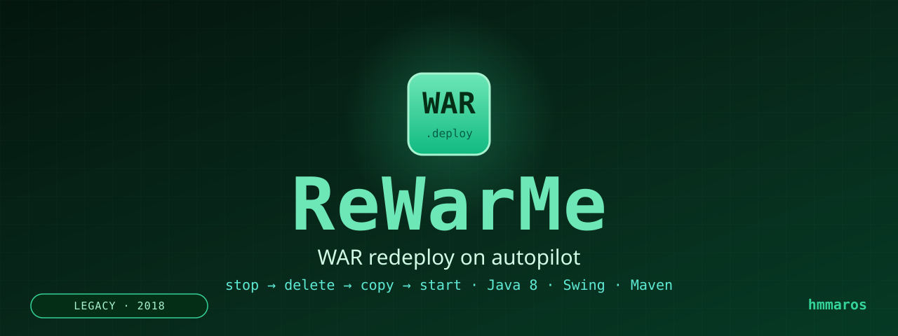
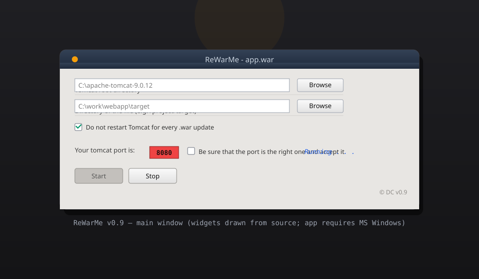

[](https://github.com/hmmaros/re-war-me/actions/workflows/build.yml)


> **LEGACY · 2018** — Java 8 · Swing · Maven · Windows
>
> One of my early tools, kept on GitHub for posterity. It solved a real
> annoyance at the time — and I'm still a little proud of it.

---

## The Story

Back in 2018, deploying a WAR meant a four-step ritual: stop the server, delete
the old artifact, drop in the new one, and restart — *by hand*, every single
time I rebuilt the app.

I built ReWarMe to kill that ritual. Point it at Tomcat, point it at your
`target/` folder, click Start, and it watches the build output. The moment you
rebuild, it handles **stop → delete → copy → start** on its own.

It started as a personal painkiller. I keep it online as a reminder that you
don't need a fancy CI/CD stack to automate the boring parts.

---

## At a glance

| The good | The honest truth |
| --- | --- |
| Watches a folder and auto-redeploys `.war` files | Polls every 5 s — `WatchService` was not used |
| Detects the Tomcat HTTP port from `server.xml` | Falls back to `8080` silently when it can't |
| Validates the chosen folder is a real Tomcat (`bin/` + `webapps/`) | Shells out to `cp` / `copy` instead of NIO |
| Works on Windows, Linux, macOS | Process-kill via port is Windows-only; other paths still `TODO test` |
| Persistent logging to `ReWarMe.log` | The log is named after... this project, for once |



---

## Quick start

```bash
# build
mvn clean package

# run
java -jar target/re-war-me-0.9.jar
```

1. **Browse → Tomcat root directory** (e.g. `C:\apache-tomcat-9.0.12`).
2. **Browse → project target directory** holding the `.war`.
3. Check the detected port, tick the accept-box, press **Start**.
4. Rebuild your app — ReWarMe handles the rest. Press **Stop** to halt.

See the full reference below for every option.

---

## Retrospective: what I'd build differently today

- **`WatchService` instead of a 5-second poll** — and no thread pool juggling.
- **`Files.copy` instead of shell `cp`/`copy`**, and `ProcessBuilder` for
  starting Tomcat instead of `Runtime.exec`.
- **No raw `HashMap` everywhere** — generics finally made it into style guides.
- **A Gradle/Maven build from day one** instead of IDE-only artifacts.
- **PID management done properly**, cross-platform — not `netstat | findstr`.

The message is the point: the *problem* was real, and this is what solving it
looked like before the ecosystem caught up.

---

## Archived roadmap

- [x] Automate the local deploy loop (2018)
- [x] Port detection, folder validation, logging (2018)
- [ ] Linux/macOS `findPID`/`killPID` — abandoned with the project
- [ ] Reproducible build, NIO rewrite — considered, never applied

*Status: kept as a legacy artefact; no active development.*

---

## Reference

- [Project structure](#project-structure)
- [Layering](#layering)
- [Logging](#logging)
- [Platform matrix](#platform-matrix)
- [Known issues](#known-issues)
- [Contributing](#contributing)

### Features

- Scans a build output directory every 5 seconds for new/modified `.war` files.
- Full deploy cycle: stop Tomcat, clear the old artifact, copy the new one, restart.
- *"Do not restart Tomcat for every .war update"* mode for copy-only deploys.
- Automatic HTTP port detection from `conf/server.xml` (defaults to `8080`).
- Tomcat root validation (must contain `bin/` and `webapps/`).
- Windows, Linux, and macOS command handling.

### Project structure

```
re-war-me/
├── assets/                     # README artwork (header + mockup)
├── src/
│   ├── main/Main.java          # Entry point
│   ├── graphics/               # MainFrame, FileChooser (Swing view)
│   ├── controller/             # Functions, Polling, ExecuteCommands (logic)
│   ├── model/PathsModel.java   # Shared state
│   ├── finals/                 # Finals (constants), Texts (strings)
│   ├── logger/MyLogger.java    # Logging setup
│   ├── resources/LogoReWarMe.png
│   └── META-INF/MANIFEST.MF    # Main-Class: main.Main
└── pom.xml                     # Maven build (mainClass: main.Main)
```

### Layering

- **View** (`graphics`) — Swing windows/widgets, no business logic.
- **Controller** (`controller`) — polling loop, deploy pipeline, OS commands.
- **Model** (`model`) — shared state (selected paths).
- **Support** (`finals`, `logger`) — constants and logging.

Keep new UI in `graphics`, deploy logic in `controller`, shared state in
`model`, and every hard-coded string/number in `finals`.

> Design rules for this codebase are documented in [AGENTS.md](AGENTS.md).

### Logging

`java.util.logging` (level `ALL`) appends to `%T/ReWarMe.log`.

Useful markers: `There is no WAR file in this directory` (nothing to deploy),
`Waiting to take down server` (Tomcat slow to stop), `File modified ...`
(a change triggered the pipeline).

### Platform matrix

| Operation | Windows | Linux / macOS |
| --- | --- | --- |
| Stop / start Tomcat | `shutdown.bat` / `startup.bat` | `shutdown.sh` / `startup.sh` |
| Copy WAR | `copy ...` | `cp ...` |
| Delete artifact | `del /F /Q` / `rmdir /s /q` | `rm -f` / `rm -rf` |
| Force stop via port | `netstat -ano \| findstr :<port>` + `taskkill` | *(TODO)* |
| Port detection | `conf/server.xml` | `conf/server.xml` |

> **Note:** the Linux/macOS force-stop path (`findPID`/`killPID`) is not
> implemented.

### Known issues

- Icon loads from `src/resources/LogoReWarMe.png` *relative to the working
  directory* — not bundled into the JAR.
- Empty fields produce a generic "Please fill in all fields!" instead of
  pointing at the missing one.
- Polling uses fixed 5 s/500 ms scheduling intervals coded in `Polling.java`.

### Contributing

1. Fork and branch (`git checkout -b feature/your-feature`).
2. Follow [AGENTS.md](AGENTS.md): no new dependencies, constants in `Finals`,
   strings in `Texts`, keep the MVC-like layering.
3. Commit clearly, push, open a pull request.

---

## Part of the 2018 Toolbox

Three small experiments from the same era, kept for posterity:

| Repo | What it did |
| --- | --- |
| **ReWarMe** | WAR redeploy on autopilot |
| [**PutLegalHeaders**](https://github.com/hmmaros/put-legal-headers) | License-scanning CLI |
| [**PutLegalHeaders (GUI)**](https://github.com/hmmaros/put-legal-headers-with-ui) | The same idea, with a face |

---

## Disclaimer

ReWarMe issues real operating-system commands (`taskkill`, `rmdir`, `cp`,
Tomcat shutdown/startup scripts) against the folders you select. Only point it
at directories you intend to modify. I'm not responsible for data loss or
damage caused by deploying or deleting files with this tool.

---

## License

Released under the [MIT License](LICENSE) © 2018 hmmaros.